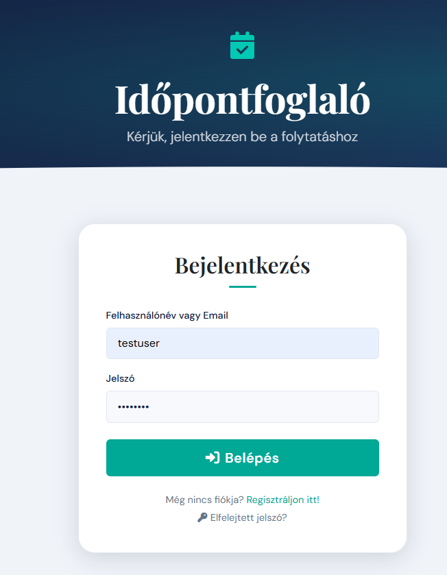
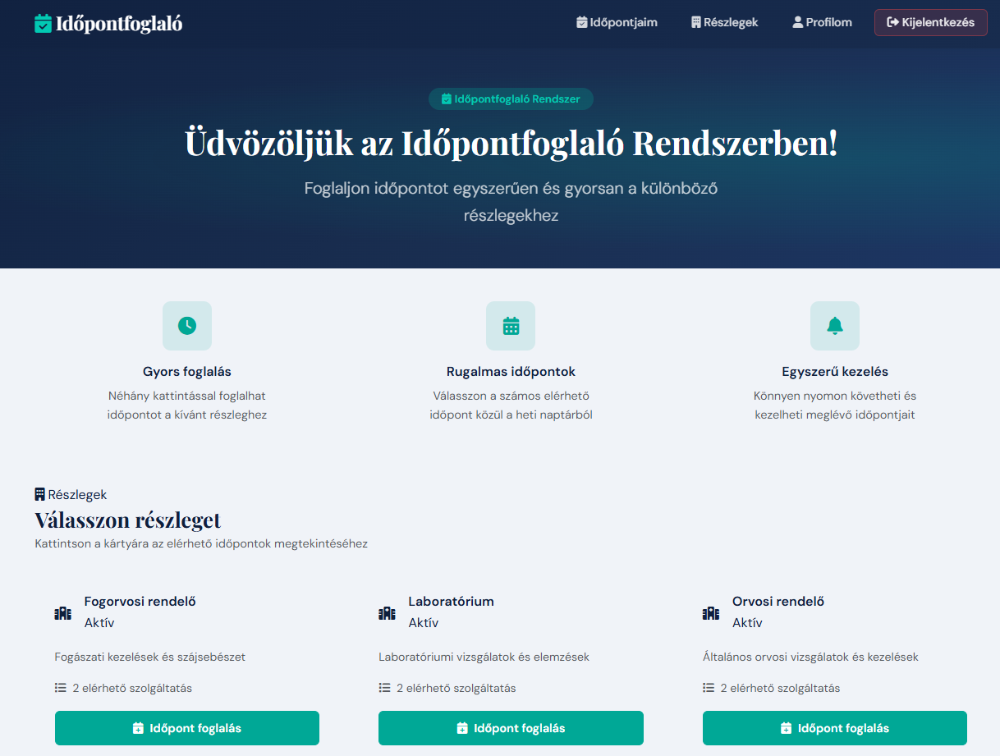
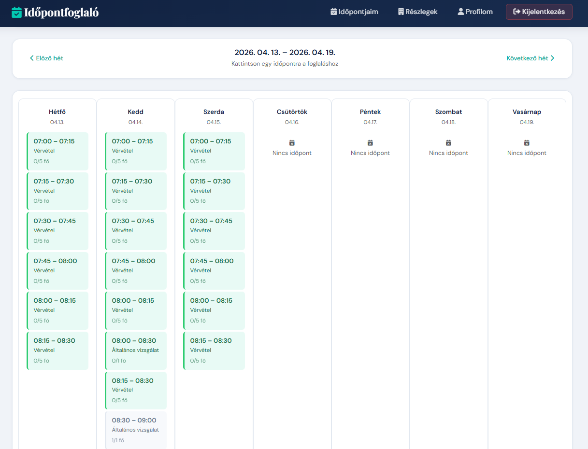
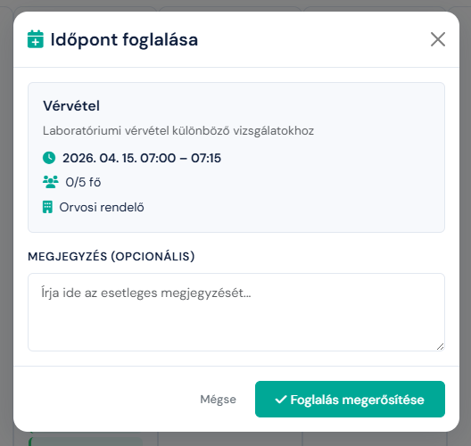
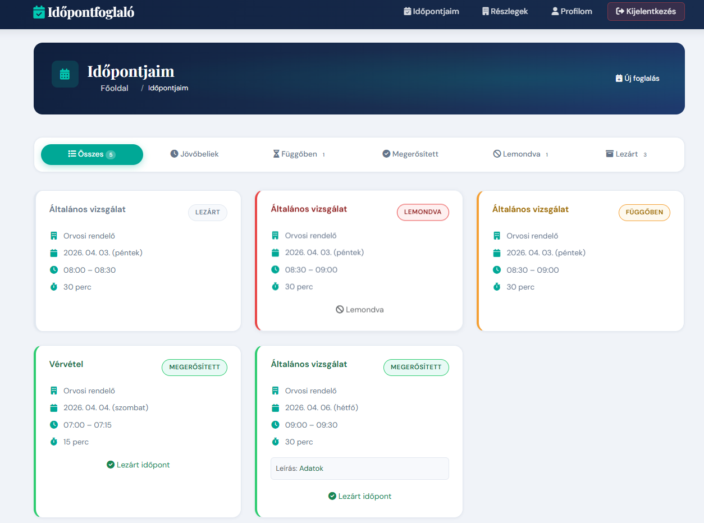
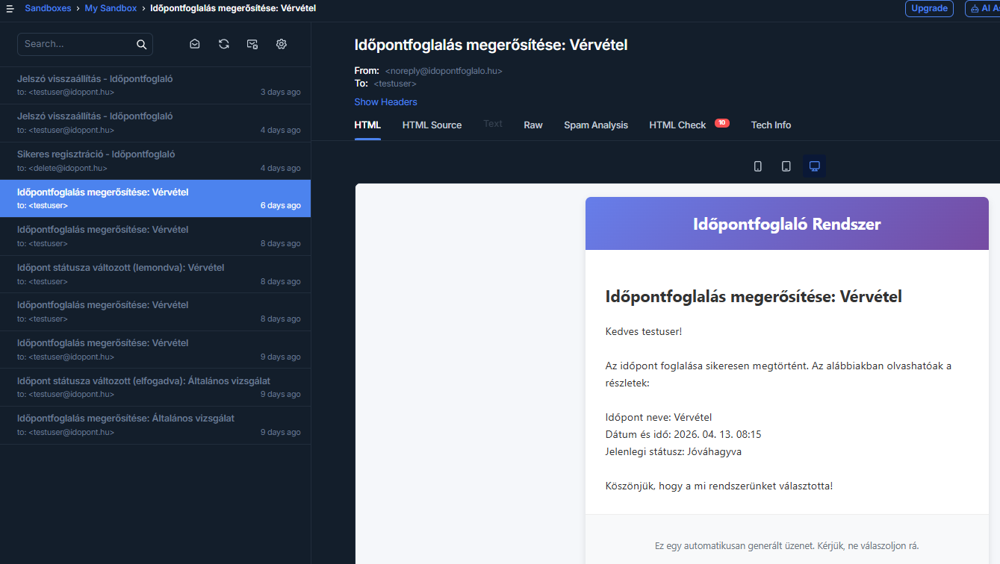

# 📅 Appointment Booking System

A full-stack web application that lets users book appointments online across different departments (e.g. administrative services). Built as a university thesis project with Spring Boot, following a real-world, production-style architecture (authentication, role-based access control, containerized deployment, and automated email notifications).

> 🎓 Originally developed as a Bachelor's thesis project (Miskolc University), this repo demonstrates practical full-stack engineering: secure user management, relational data modeling, containerization, and clean MVC architecture.

---

## 🖼️ Screenshots


| Step | Screenshot |
|---|---|
| **1. Login & Select Department** |  |
| **2. Choose Service Type** |  |
| **3. Select Available Time Slot** |  |
| **4. Confirm booking** |  |
| **5. Booked appointments** |  |
| **5. Confirmation & Email Sent** |  |


---

## ✨ Features

- **User registration & authentication** — secure sign-up and login with Spring Security.
- **Appointment booking** — users select a department and service type, then choose from available time slots.
- **Booking management** — users can view, modify, or cancel their own appointments.
- **Email notifications** — automatic booking confirmations and reminders via JavaMailSender.
- **Role-based access control**, with three distinct roles:
  - **USER** — books and manages their own appointments.
  - **DEPARTMENT_ADMIN** — manages a department's service types, available time slots, and bookings.
  - **ADMIN** — full system administration: users, departments, and roles.

---

## 🛠️ Tech Stack

| Layer | Technology |
|---|---|
| **Backend** | Java 21, Spring Boot 3.5, Spring Security, Spring Data JPA |
| **Frontend** | Thymeleaf, Bootstrap 5, JavaScript |
| **Database** | H2 (development mode) / PostgreSQL 15 (Docker mode) |
| **Build tool** | Maven (Maven Wrapper included) |
| **Email** | Mailtrap (test environment) |
| **Containerization** | Docker & Docker Compose |

---

## 🚀 Getting Started

### Prerequisites

Make sure you have installed:

- **Java 21** or newer
- *(Optional, for Docker setup)* **[Docker Desktop](https://www.docker.com/products/docker-desktop/)**

Maven itself doesn't need to be installed — the project includes the Maven Wrapper (`mvnw`).

### 1. Clone the repository

```bash
git clone https://github.com/mesterdaniel/Szakdolgozat_Idopontfoglalo.git
cd Szakdolgozat_Idopontfoglalo
```

### 2A. Run in development mode (H2 database)

The simplest way to run the project — no external database required. Data is stored in a local file-based H2 database.

**Windows (PowerShell / CMD):**
```bash
mvnw.cmd spring-boot:run
```

**Linux / macOS:**
```bash
./mvnw spring-boot:run
```

Once the app has started, open your browser at:

```
http://localhost:8080
```

### 2B. Run with Docker (PostgreSQL database) — Recommended

With Docker Desktop installed, the entire environment (app + PostgreSQL + Adminer) can be started with a single command:

```bash
docker-compose up --build
```

Available services:

- Application: [http://localhost:8080](http://localhost:8080)
- Adminer (database management UI): [http://localhost:8082](http://localhost:8082)

To stop: press `Ctrl + C`, then run:

```bash
docker-compose down
```

---

## 🔑 First Use

On first startup, a default administrator account is created automatically. Credentials can be found and configured in `src/main/resources/application.properties` (`spring.security.user.name` and `spring.security.user.password`).

Regular users can create a new account by clicking **Register** on the home page.

### Useful developer links

- H2 Console (development mode only): [http://localhost:8080/h2-console](http://localhost:8080/h2-console)

---

## ⚙️ Configuration

Main settings can be adjusted in `src/main/resources/application.properties`:

- Database connection
- Email sending (SMTP / Mailtrap)
- Session timeout

> ⚠️ **Security note:** This repository ships with default credentials (e.g. `titok123`) intended for development only. Make sure to replace these before any production use.

---

## 📁 Project Structure

```
Szakdolgozat_Idopontfoglalo/
├── src/main/java/com/BC/Idopontfoglalo/
│   ├── controller/   – HTTP endpoints
│   ├── service/      – business logic
│   ├── repository/   – data access layer
│   ├── entity/       – data model (User, Department, Appointment, …)
│   └── security/     – authentication & authorization
├── src/main/resources/
│   ├── templates/    – Thymeleaf HTML templates
│   ├── static/       – CSS, JS, images
│   └── application.properties
├── Dockerfile
├── docker-compose.yml
└── pom.xml
```

---

## 🧪 Running Tests

```bash
./mvnw test
```

---

## 📄 License

This project was developed for academic (thesis) purposes and is intended for educational use.

---

## 👤 Author

**Dániel Mester**
[GitHub](https://github.com/mesterdaniel)